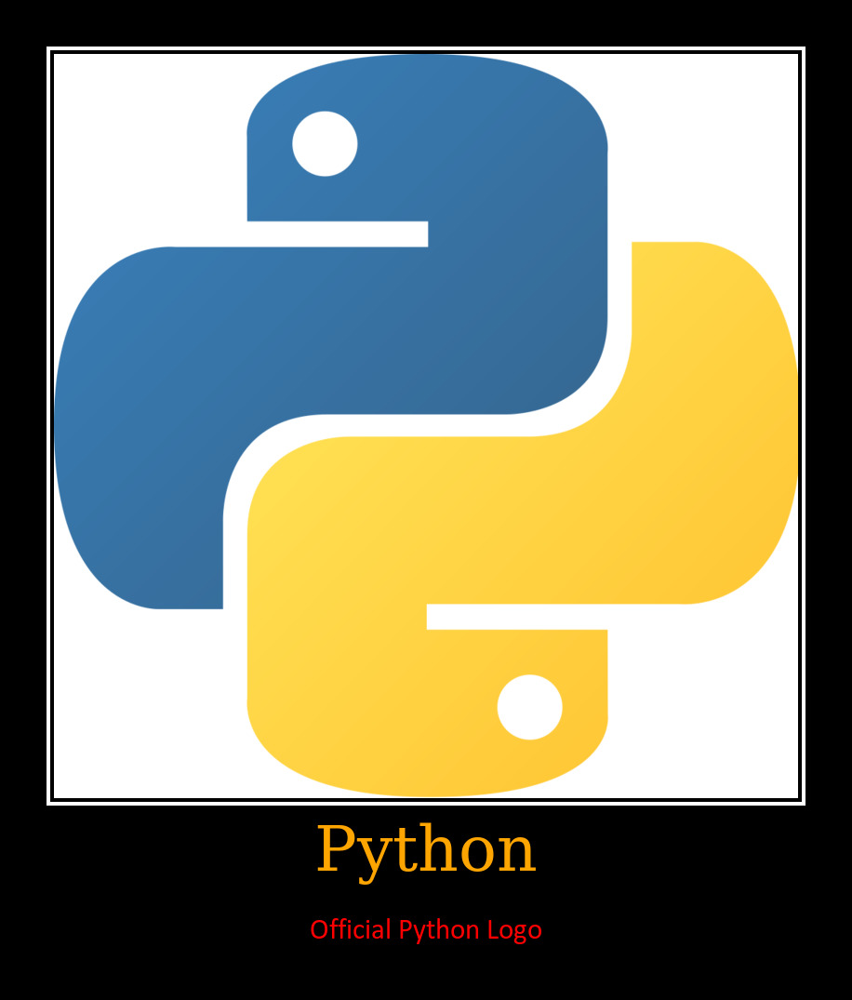

# Usage guide
`demapi` uses https://imgonline.com.ua API and so you can use many configuration settings to build your demotivators. In this guide I show you how different settings change the output image. For examples will be used official Python logo


***
## Image format
You can pass JPEG/PNG or other formats (not tested more) with such types:
#### raw `bytes`
```python
import demapi

demapi.Configure(b"123123...")
```
#### `io.BytesIO`
```python
import io
import demapi

demapi.Configure(io.BytesIO(b"123123..."))
```
#### `str` as path
```python
import demapi

demapi.Configure("image.png")
```
#### `pathlib.Path` instance
```python
import pathlib
import demapi

demapi.Configure(pathlib.Path("assets") / "image.png")
```
#### `io.BufferedReader` instance
```python
import demapi

demapi.Configure(open("image.png", "rb"))
```
Any of these methods give same effects. Make it for your convenience

## Result
After you downloaded demotivator you have `GeneratedImage` instance:

```python
import demapi


conf = demapi.Configure(
    base_photo="example_source.png",
    title="Python",
    explanation="Official Python Logo"
)
image = conf.download()

# 1) Save image to disk
image.save("example.png")

# 2) Convert to base64
image.as_base64()

# 3) Get raw bytes, i.e. b'123123....'
image.content

# 4) Get url where photo has been downloaded from
image.url
```

## Configuring
As you can see from README Overview, before any request you should configure your demotivator through `Configure` class and this configuring is not sync or async dependent

There are settings and effects showed below

#### Motivators
Motivators could be generated through the same `Configure` class
```python
import demapi

demapi.Configure(
    image,
    title="Python",
    explanation="Official Python Logo"
)
```

***

#### `title` & `explanation`
```python
import demapi

demapi.Configure(
    image,
    title="Python",
    explanation="Official Python Logo"
)
```

***
You can pass only `title` without `explanation`
```python
import demapi

demapi.Configure(
    image,
    title="Python",
)
```

***
Or otherwise
```python
import demapi

demapi.Configure(
    image,
    explanation="Official Python Logo",
)
```

***
Or empty at all
```python
import demapi

demapi.Configure(image)
```

***
#### `header_size` & `explanation_size`
For example, inverse title and explanation. Available sizes could be found in [params.py](./demapi/configure/params.py)
```python
import demapi

demapi.Configure(
    image,
    title="Python",
    explanation="Official Python Logo",
    title_size=demapi.Size.TINY,
    explanation_size=demapi.Size.LARGE
)
```

***
#### `header_color` & `explanation_color`
Change title and explanation colors. Available colors could be found in [params.py](./demapi/configure/params.py)
```python
import demapi

demapi.Configure(
    image,
    title="Python",
    explanation="Official Python Logo",
    title_color=demapi.Color.ORANGE,
    explanation_color=demapi.Color.RED
)
```

***
#### meta
* `output_image_format`: Output image format. Check out [params.py](./demapi/configure/params.py)
* `copy_exif_and_metadata`: Copy original image exif and metadata
* `jpeg_type`: JPEG type (Standard/Progressive). Check out [params.py](./demapi/configure/params.py)
* `jpeg_quality`: [0; 100] value of squeezing

## Optimize sessions
By default `demapi` creates a new session for every sync/async request. You can pass your own through `connector` argument for keeping single connection for every API call

### Sync
Sync connection implemented with `requests`
```python
import demapi
import requests


dem = demapi.Configure(
    base_photo=image,
    title="Python",
    explanation="Official Python Logo",
)
photo = dem.download(
    connector=demapi.RequestsConnector(session=requests.Session())
)
```
Or with context manager
```python
with demapi.RequestsConnector.new() as connector:
    sync_photo = dem.download(connector)
```
### Async
Async connection implemented with `aiohttp`

```python
import asyncio
import demapi
import aiohttp


async def main():
    dem = demapi.Configure(
        base_photo=image,
        title="Python",
        explanation="Official Python Logo",
    )
    session = aiohttp.ClientSession()
    photo = await dem.coroutine_download(
        connector=demapi.AiohttpConnector(session=session)
    )
    await session.close()


asyncio.run(main())
```
Or with async context manager
```python
async with demapi.AiohttpConnector.new() as connector:
    session = aiohttp.ClientSession()
    photo = await dem.coroutine_download(connector)
```
## Custom
You can implement your own sync/async connector based on any http library through `BaseAsyncConnector` and `BaseSyncConnector`

## The end
