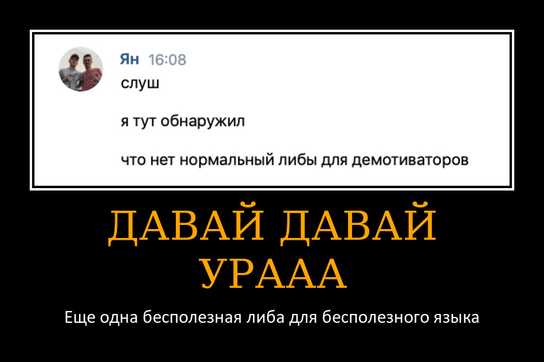

# DemAPI
> Make customizable demotivators and motivators through imgonline.com.ua API. Supports async-await style


***
__Documentation__: Later

[](https://coveralls.io/github/deknowny/demapi?branch=main&dummy=unused)

## Overview
Configure request params such as text, color, size etc.
And then download the image. Optionally save to dick otherwise
use `image.content` for raw bytes object
```python
import demapi


conf = demapi.Configure(
    base_photo="example_source.png",
    title="Demotivator title",
    explanation="Demotivator explanation (the second line)"
)
image = conf.download()
image.save("example.png")
```

Or via `await` (based on `aiohttp`):

```python
image = await conf.coroutine_download()
```

## Installation
Install the latest version through github:
```shell
python -m pip install https://github.com/deknowny/demapi/archive/main.zip
```
## Contributing
Check out [CONTRIBUTING.md](./CONTRIBUTING.md)
